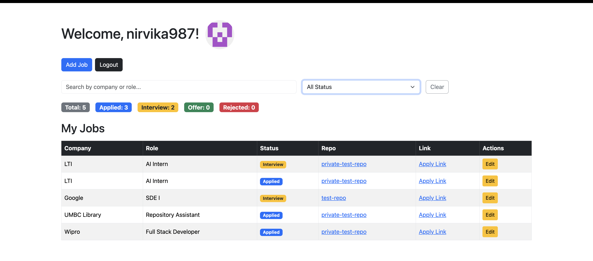

# Job Tracker

A full-stack job application tracker built with Node.js, Express, and MongoDB. 
Authenticate with GitHub OAuth and manage your job search in one place.

🔗 **Live Demo:** https://job-tracker-gpop.onrender.com/

## Features

- GitHub OAuth login
- Add and edit job applications
- Filter by application status
- Search by company or role
- Color coded status badges
- Live stats bar showing counts per status
- Deployed on Render

## Tech Stack

- **Backend:** Node.js, Express.js
- **Database:** MongoDB, Mongoose
- **Auth:** GitHub OAuth, Passport.js, express-session
- **Views:** EJS templating
- **Deployment:** Render

## Getting Started

### Prerequisites
- Node.js installed
- MongoDB connection string
- GitHub OAuth app credentials

### Setup

1. Clone the repo
   git clone https://github.com/Nirvika12/Job-Tracker.git
   cd Job-Tracker

2. Install dependencies
   npm install

3. Create a .env file in the root folder
   - MONGODB_URI=your_mongodb_connection_string
   - GITHUB_CLIENT_ID=your_github_client_id
   - GITHUB_CLIENT_SECRET=your_github_client_secret
   - SESSION_SECRET=your_session_secret
   - CALLBACK_URL=http://localhost:8000/auth/github/callback

4. Run the app
   npm start

5. Open http://localhost:8000

## Screenshots

